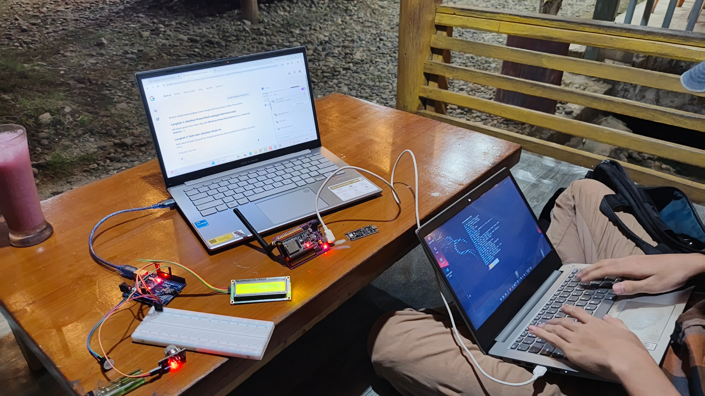
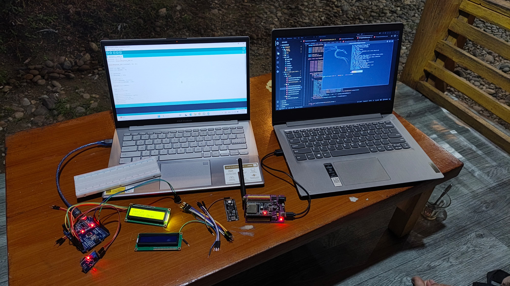

<!---

--->

    
    

    

        <i>
            <b>
            Interested in red teaming, low-level programming, embedded systems, bio-technologies, aeromodelling, aerospace, radiology, electrical engineering, mechanical engineering, and computer science.
             
             
            Currently working as halftime bug/threat hunter & security researcher.
            </b>
        </i>
    

    <h3><b><i> STATS & TECHSTACK</i></b></h3>
    
     
    
     
    
    <!---
    br />
    
     
    
     
    --->
</>

    <h3><b><i> GALLERY & OVERVIEW</i></b></h3>
    

        
        <!---
        
        --->
    

    

        
    

    

